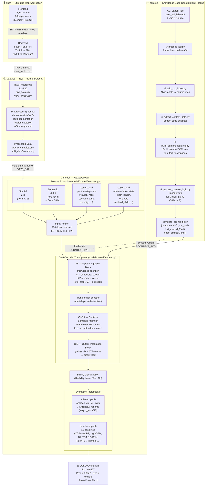

# GazeDecoder — Architecture Diagrams

This document contains two architecture diagrams for the GazeDecoder open-source tool:
one in **Mermaid** syntax and one in **PlantUML** syntax.

---

## Mermaid Diagram



---

## PlantUML Diagram

```plantuml
@startuml GazeDecoder_Architecture
skinparam backgroundColor #FAFAFA
skinparam componentStyle rectangle
skinparam defaultFontName Helvetica
skinparam defaultFontSize 12
skinparam ArrowColor #555555
skinparam PackageBorderColor #888888
skinparam PackageBackgroundColor #F0F4FF
skinparam ComponentBackgroundColor #FFFFFF
skinparam ComponentBorderColor #6688AA
skinparam NoteBackgroundColor #FFFFF0
skinparam NoteBorderColor #BBBB00

title GazeDecoder — System Architecture

' ─────────────────────────────────────────────
' PACKAGE 1 — Stimulus Web Application
' ─────────────────────────────────────────────
package "app/  ·  Stimulus Web Application" as APP #EEF5FF {

    package "app/frontend/" as FE_PKG {
        [Vue 3 + Vite\nElement Plus\n28 page views] as FE
    }

    package "app/backend/" as BE_PKG {
        [Flask REST API] as FLASK
        [EyeTracker\n(Tobii Pro SDK\n+ .NET CLR)] as TOBII
        [DataAnalyzer\nfixation / saccade\ndetection] as ANALYZER
        [SessionManager\nsession lifecycle] as SESSION
    }

    FE --> FLASK : HTTP\n/init /switch\n/stop /analyze
    FLASK --> TOBII
    FLASK --> ANALYZER
    FLASK --> SESSION
}

' ─────────────────────────────────────────────
' PACKAGE 2 — Eye-Tracking Dataset
' ─────────────────────────────────────────────
package "dataset/  ·  Eye-Tracking Dataset  (N=20)" as DS #EFF8EE {

    database "Raw Recordings\nP1 – P20\nraw_data.csv\nview_switch.csv" as RAW

    package "dataset/scripts/" as SCRIPTS_PKG {
        [Preprocessing Scripts\n× 7 (gaze segmentation,\nfixation detection,\nAOI assignment)] as SCRIPTS
    }

    database "Processed Data\nAOI.csv  metrics.csv\nsplit_data/ (3 037 windows)" as PROC

    RAW --> SCRIPTS : pipeline
    SCRIPTS --> PROC
}

' ─────────────────────────────────────────────
' PACKAGE 3 — Knowledge Base Pipeline
' ─────────────────────────────────────────────
package "context/  ·  KB Construction Pipeline" as CTX #FFF8EE {

    [① process_aoi.py\nParse & normalise AOI labels] as PA
    [② add_src_index.py\nAlign labels → Vue source lines] as ASI
    [③ extract_context_data.py\nExtract code snippets] as ECD
    [④ build_context_features.py\nBuild pseudo-DOM tree\n& text descriptions] as BCF
    [⑤ process_context_logic.py\nEncode with all-MiniLM-L6-v2\n(384-d text + 384-d code)] as PCL

    database "context_features/\ncomplete_econtext.json\n{componentInfo, src_path,\ntext_embed(384d), code_embed(384d)}" as ECONTEXT

    [AOI Label Files\n+ Vue 3 Source] as AOI_SRC

    AOI_SRC --> PA
    PA --> ASI
    ASI --> ECD
    ECD --> BCF
    BCF --> PCL
    PCL --> ECONTEXT
}

' ─────────────────────────────────────────────
' PACKAGE 4 — GazeDecoder Model
' ─────────────────────────────────────────────
package "model/  ·  GazeDecoder" as MODEL #FFF0F0 {

    package "model/shared/features.py  ·  Feature Extraction" as FEAT_PKG {
        [Spatial  2-d\n(norm x, y)] as SP
        [Semantic  768-d\nText-384d + Code-384d\n(from econtext)] as SEM
        [Layer 1  8-d  per-timestep\nfixation_ratio, saccade_amp\nvelocity, dispersion, …] as L1
        [Layer 2  8-d  whole-window\npath_length, entropy\ncentroid_shift, …] as L2
        [Input Tensor  786-d / timestep\n[SP | SEM | L1 | L2]] as VEC
        SP --> VEC
        SEM --> VEC
        L1 --> VEC
        L2 --> VEC
    }

    package "model/shared/models.py  ·  GazeDecoder Transformer" as ARCH_PKG {
        [IIB  ·  Input Integration Block\nMHA cross-attention\nQ = behavioral stream\nKV = context vector\nctx_proj: 768 → d_model] as IIB
        [Transformer Encoder\n(multi-layer self-attention\n+ position encoding)] as TENC
        [CtxSA  ·  Context-Semantic Attention\nre-weight hidden states\nover KB context] as CTXSA
        [OIB  ·  Output Integration Block\ngating: ctx + L2 features\n→ binary logit] as OIB
        IIB --> TENC
        TENC --> CTXSA
        CTXSA --> OIB
    }

    VEC --> IIB

    package "Evaluation Notebooks" as EVAL_PKG {
        [ablation.ipynb\nablation_ctx_v2.ipynb\n7 ChronosX variants\n(vary b_in × OIB conditioning)] as ABL
        [baselines.ipynb\n12 baseline models\nXGBoost, RF, LightGBM\nBiLSTM, 1D-CNN, PatchTST\niTransformer, Mamba …] as BASE
    }

    OIB --> ABL
    OIB --> BASE
}

' ─────────────────────────────────────────────
' Cross-package data flows
' ─────────────────────────────────────────────
TOBII --> RAW : raw_data.csv\nview_switch.csv
SESSION --> RAW

PROC --> FEAT_PKG : split_data/ windows\n(GAZE_DIR)

ECONTEXT --> SEM    : text & code embeddings
ECONTEXT --> IIB    : context vectors\n(ECONTEXT_PATH)

' ─────────────────────────────────────────────
' Results
' ─────────────────────────────────────────────
note right of EVAL_PKG
  **LOSO Cross-Validation Results**
  F1    = 0.9467
  Prec  = 0.9531
  Rec   = 0.9404
  Scott–Knott Tier 1
  (vs 12 baselines)
end note

@enduml
```
